[[TOC]]

# **Introduction to Uwazi**

To manage records and documents, most organisations today use folders or categories on platforms like DropBox, OneDrive and Google Drive so that staff can access them later.  Although safe and effective, these platforms simply provide a safe space for these documents and provide no connections or analysis. 

What if organising documents could make their contents come alive? Uwazi goes beyond tags and filenames to organise your documents. Each document can be critical in telling a story: an email that asks for a favor from a politician, a testimony from a witness of police violence, the ruling of a court on a human rights case. When these stories are connected by the platform, the bigger picture of patterns and systems becomes clearer: ongoing corruption, systematic police violence, legal human rights precedence and abuse of power. 

Uwazi is built to do exactly this – highlight and organise the important information in each document, and create relationships between documents. Uwazi illuminates the bigger picture that human rights document collections uncover.

### What problems does Uwazi solve?

Most document management systems organise contents based on a document’s metadata such as author, department, person, event, or year. 

However, for human rights organisations, a document is often much more than these basic descriptors assigned to it . The content within the document also provides important insight. 

Uwazi addresses these problems by putting content and connections at the heart of the platform. Within each document there is important information to highlight, tag, organise, reference, and connect to other documents. In Uwazi, one paragraph referencing a military commander responsible for a human rights violation can be connected to another paragraph in another document that provides more biographical information about the same person.

### Who is it for?

Uwazi was designed to address the needs of human rights organisations. Human rights NGOs, National Human Rights Institutions, Universities, Journalists, Courts, and others working with large document collections can also benefit from Uwazi’s user friendly features. 

More information: [https://www.uwazi.io/](https://www.uwazi.io/)

This user guide (as of 15 May 2020) is continuously updated and can be found online: [https://github.com/huridocs/uwazi/wiki](https://github.com/huridocs/uwazi/wiki)

# **History of Uwazi**

Human rights defenders rely on information from many sources in order to do their work effectively, from laws and jurisprudence to victim testimonies and resolutions. This information is crucial for ensuring human rights are respected and protected. 

However, it’s not enough to simply collect the documents that contain this information. In order to be understood, the documents must be organised in a meaningful way: case documents need to be connected to judgement documents, judgement documents need to be connected to judges, and so on. 

It’s for this reason that in 2015 HURIDOCS began to build [Uwazi](https://www.uwazi.io/), an open-source platform that allows any human rights project to organise and publish their own document collections. The decision to do so was many years in the making. Over time, we had learned through consultations with human rights organisations that such a tool was sorely needed. Furthermore, we had witnessed firsthand how a well-designed technological solution could put human rights case law in the hands of those who need it most.

In 2010, HURIDOCS partnered with the Institute for Human Rights and Development in Africa (IHRDA) to develop the [African Case Law Analyser](http://caselaw.ihrda.org/). The website addressed an enormous problem that we see in many regions – that access to human rights jurisprudence is almost impossible to obtain, hindering the work of human rights defenders, journalists and lawyers. 

And several years later, HURIDOCS and the Center for Justice and International Law (CEJIL) started to collaborate on [SUMMA](https://summa.cejil.org/), a Case Law Analyser for the Americas, to provide access to the Inter-American Court and Commission cases. 

After building two Case Law Analysers, HURIDOCS decided to launch Uwazi to address these gaps on a broader scale. We continue to develop new features in response to user feedback, and we are currently working to expand the platform to [support human rights investigations](https://huridocs.org/2018/05/starting-at-the-source-introducing-uwazi-reveal/) that manage large amounts of source documents and media. All the while, we are maintaining our focus on ensuring that Uwazi meets the pressing security needs of human rights organisations. 

Significant funding for Uwazi development has been provided by the MacArthur Foundation and the Center for Justice and International Law (CEJIL).

# **Glossary of Terms **

* **API** stands for application programming interface. It allows one program to request data from another.

* **Connection** - In Uwazi, a connection allows entities to be related to each other. We sometimes use this word interchangeably with Relationship.

* **Cookies **are bits of information shared by the websites you visit and stored on your computer’s hard drive. They help improve your web browsing experience as they "remember" your preferences from previous visits.

* **CSS** is a language that describes the style of an HTML document. It describes how HTML elements should be displayed. 

* **CSV file** is a comma separated file that can be imported into Uwazi. It is particularly helpful when you have a large number of documents and metadata that need to be migrated into Uwazi.  

* **Document** - In Uwazi, a document is an entity with a  PDF. When a document is viewed, the PDF is shown in the main Uwazi panel.

* **Entity** - In Uwazi, an entity has properties, is filterable, and can have connections(e.g. court, person, event).

* **EntityInfo** is a collection of data visualisation components that allows an entity’s information to display by opening the side panel and loading its data inside.

* **Fallback** is an alternative document if the main (or intended) one is not available. 

* **Filters** allow you to narrow down the number and type of documents and categories.

* **Landing page** is the first page or the home page that the users see when visiting your Uwazi instance. 

* **Library**is the place where all of your entities are displayed together for the user to easily access. 

* **Metadata** is data that provides information about other data. In Uwazi, it usually describes an entity.

* **Private Documents** are documents that have been uploaded onto Uwazi but have not been published yet. They are only accessible to the administrator(s) or logged in users. 

* **Property** is a descriptive attribute that is assigned to entities (e.g. author, significance, status, etc).

* **Public Documents** are visible to anyone who accesses your Uwazi instance.

* **Relationship Types** are different types of connections that you can form in between or even within entities. Each type of connection should be labeled accordingly.

* **Reference** connects selected content in a document to something else. References can be made to: other selected content in the same document, other selected content in another document, an entire document, or an entity.

 

* **Template** is a starting point in Uwazi. They can be built and customised for each type of entity. You can add different metadata properties within each template.

* **Thesauri / Thesaurus** - In Uwazi, thesauri refer to lists of terms that are referred to throughout an Uwazi instance. These terms are also referenced in select and multi-select properties of entities. Thesauri is the plural form of thesaurus.

* **User** is anybody who uses or accesses Uwazi. There are different types of roles and access levels.

* **ZIP file** is a compressed format that you need to use when importing the main pdf(s) along with your csv file during the last step of a data migration. It should contain all the documents that you want to import, as well as your CSV file that has the metadata. 

# **How to Configure Your Account**

### Change your account information

Step 1: Login to your Uwazi instance.

Step 2: Under **Settings**, click **Accounts**.

Step 3: You can change your email address here, as well as your account password.

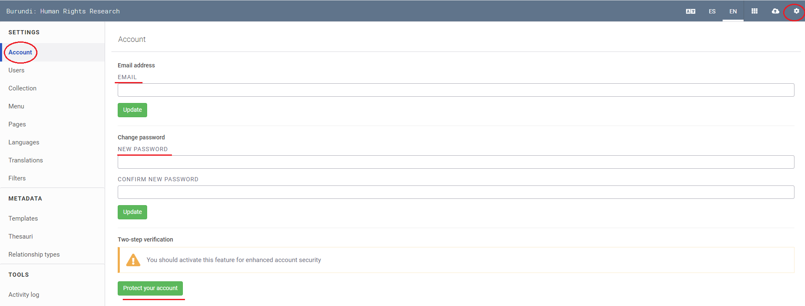

### Recover your password (*[screencas*t](https://drive.google.com/open?id=1fJcdhGPGRZEZMn6ExzS2csinH3FJwcBd))

Step 1: At the login screen, click **Forgot Password?**.

Step 2: You will receive an email from the [no-reply@uwazi.io](mailto:no-reply@uwazi.io) account. Follow the instructions. 

* If you cannot find this recovery email, please check if it has been filtered into your ‘’Spam’’ folder.

* To reinforce your account’s security, we recommend that you use unique and long passwords (a-Z, 0-9, &%).

### Enable two-factor authentication (*[screencas*t](https://drive.google.com/open?id=1G02gKDvIejl4NxwpyiIqiIU5KPjbamBE))

To add an extra layer of security to your Uwazi instance:

Step 1: Login to your Uwazi instance.

Step 2: Under **Settings**, click **Accounts**.

Step 3: You will see **Two-step verification**, click on **Protect your Account**.

Step 4: Open [Authy](https://authy.com/features/setup/) or [Google Authenticator](https://support.google.com/accounts/answer/1066447?co=GENIE.Platform%3DAndroid&hl=en) and generate your verification code.

Step 5: Enter the code and click **Confirm**.

* If you have successfully enabled two-factor authentication, your account settings will reflect this.

### Login with two-factor authentication (*[screencas*t](https://drive.google.com/open?id=1lYbJHkDrDoAeYzoVcPcYQPoAWyUf3JmR))

Step 1: Login to Uwazi with your credentials..

Step 2: You will be prompted to input your authentication code. Enter the code from Authy or Google Authenticator.

* If the code is approved, you will be logged in.

FAQs related to two-factor authentication	

* Google Authenticator: [https://support.google.com/accounts/answer/185834?hl=en](https://support.google.com/accounts/answer/185834?hl=en)

* Authy application: [https://authy.com/help/](https://authy.com/help/)

# **How to Create, Edit and Delete Users**

### Understanding user permissions

If you work in a team or in collaboration with other people, Uwazi allows administrators to create new users with specific permissions to help you update your collection of documents. Uwazi currently supports two different kinds of roles: 

### Add new users to your instance (*[screencas*t](https://drive.google.com/open?id=12Z-HtNoPU2vcS80CG30496ECAL5vEJI3))

Step 1: Only an Admin can create new users. Go to **Settings** and click on **Users**.

Step 2: You will see a list of all the current users who have access to your collection.

Step 3: You can create new users by clicking the green **Add user** button at the bottom. Here, you can also edit or delete users, as necessary.

Step 4: Enter a **username**, their **email address** and select a role (**Admin** or **Editor**) for them.

Step 5: Once this information is entered, click the green **Save** button and an email will be sent to that person with a link that allows them to set their own password. 

**How to Edit Your Site Settings**

Step 1: Click on **Settings**, then click on **Collection**. 

Step 2: After you have made all your changes, please ensure that you click **Save**.

### Change the name of your collection (*[screencas*t](https://drive.google.com/open?id=1_6ele0a2bmdSbLD1-UjUfSd53JaUL54T))

* The name is "Uwazi" by default, but you can change it to anything you like.

### Make your collection private (or public)

* If you are handling sensitive information or you just want your collection to be accessible only via login, you can click the checkbox to make the instance private.

* By activating this option, your information will not be crawled by search engines, and users will be prompted with a login screen when trying to access your documents or entities.

### Change the date format

* You may change the date format, based on your preference.

### Set your landing page

* The landing page is the first thing users will see when visiting your Uwazi instance. 

* By default, the landing page is set to the full Librarywithout any filters applied.

* But you can use any page from your Uwazi instance as the landing page instead. Copy and paste the URL on the text box, accordingly. These are some examples:

    * A static page: /page/dicxg0oagy3xgr7ixef80k9

    * A library query: /library/?searchTerm=test

    * A document or entity: /document/4y9i99fadjp833di /entity/9htbkgpkyy7j5rk9

    * Always use a URL relative to your site, starting with / and skipping the [https://yoursite.com](https://yoursite.com).

### Track web analytics

If you want to track analytics related to your collection visits, Uwazi supports both Google Analytics and Matomo.

* Find your unique ID

    * FAQ on  how to set up a [Google Analytics ID](https://support.google.com/analytics/answer/3123666?hl=en) to track website visits

    *  If you are hosting your Uwazi with HURIDOCS, we provide Matomo as part of the hosting. Please contact us to activate your account.

* Add this unique ID to Uwazi.

### Mailer configuration

This allows you to configure your own SMTP or any other mail server. Instances hosted by HURIDOCS have the mail system already configured.

* This is a JSON configuration object that should match the options values required by Nodemailer, as explained [here](http://nodemailer.com/smtp/).

* This setting takes precedence over all other mailer configuration. If left blank, then the configuration file in /api/config/mailer.js will be used.

### Contact form configuration

If you have added a contact form on one of your pages, this is where you would add the email address that receives the information from that form. Click [here](#heading=h.2foqgdkokzfp) to learn how to add and configure a contact form on a webpage.

### Public form configuration

If you have added a public intake or submission form on one of your pages, this is where you would add the template ID (representing the numbers in the template URL). You must white-list the template IDs for which public forms are expected. Please include a comma-separated list of template IDs without spaces. Click [here](#bookmark=id.7zow8h6oowf5) to learn how to add and configure a public submission form on a webpage.

### Show cookies policy on your site

Cookies are bits of information used by some websites you visit and stored on your computer’s hard drive. Uwazi uses cookies to deliver an optimal experience to users. If you would like users to see a notification about the use of cookies on your instance, check **Show Cookie Policy**. 

### Advanced customisations

This area is reserved for changing the style or appearance of your Uwazi instance.

* To create your own customization using CSS language, click on **Custom Styles**.

* To add a logo or any other image files, click on **Custom Uploads**.

# **How to Create Templates and Add Properties**

Templates are the foundation of your Uwazi platform as they allow you to attribute consistent, structured metadata to your entities. Within each template, you can assign a variety of properties like:

* Text

* Numerics

* Select (needs thesaurus)

* Multi-select (needs thesaurus)

* Date, date range, multi date, multi date range

* Rich text

* Geolocation

* External links

* Media (for video and audio embedding or self hosting)

* Relationship - allow you to create connections between this entity and another one

### Add different properties to a template (*[screencas*t](https://drive.google.com/open?id=1pqcKphveaHFJqrrBPT53b2jE5lo75BMf))

Properties provide an important way for users to view important metadata at a glance and filter the collection to better understand and analyse the collection.

Step 1: From **Settings**, click on **Templates**.

Step 2: Click on the green **Add Template** button. 

* There will be two default properties: Title and Date Added.

Step 3: Name your template.

Step 4: On the right side of the template, there is the sidebar with different **Properties**. Each property will provide the user with more information about your document. You can add as few or as many as you wish. 

Step 5: Drag and drop one property at a time onto the template, and give it a name. 

Step 6: Remember to click on **Save** after you have created properties for each template. 

<table>
  <tr>
    <td>Note:
When you add a select or multi-select property to a template, you will see a field entitled "Select list*" in which you are required to choose a Thesaurus from the dropdown. Related to: How to create thesauri.
If you intend to do a CSV import to bring your metadata into Uwazi in bulk, remember that the property names on these templates must match your field names in the CSV file. This will allow the data migration to be imported successfully with all the metadata in the correct template.
If your instance will be in Arabic by default, the templates and properties should be created in latin characters and then translated into Arabic. If this is not done, it will trigger a known bug. Our developers are working to fix it.</td>
  </tr>
</table>

# **How to ****Create Thesauri**

<table>
  <tr>
    <td>In Uwazi, a thesaurus is a list of terms that are referred to throughout an Uwazi instance to provide structured details. These terms are also referenced as properties within each entity. Thesauri is the plural form of thesaurus.</td>
  </tr>
</table>

Using a thesaurus will make data entry and retrieval more precise, coherent and easy.

Step 1: Go to **Settings**, click on **Thesauri**.

* Here you will see all the thesauri that have been created so far. 

Step 2: Click on the green **Add thesaurus** button.

Step 3: Name your thesaurus, then you can start typing items to include on this list.

* You can move items around by dragging and dropping.

* You can also use the **Sort **option to organize your list alphabetically. 

* For certain thesauri, nesting values together with the **Add Group** option can make information more accessible.

Step 4: When you are finished, click **Save**.

 

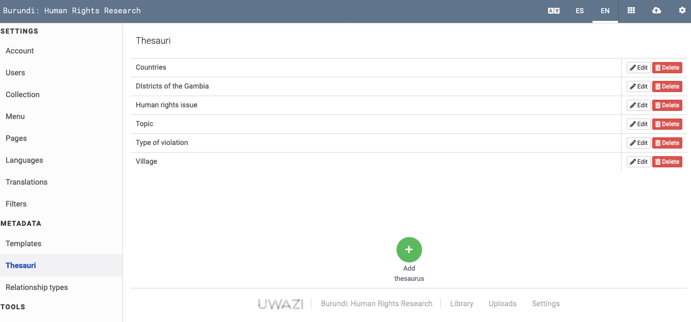

### Import thesauri from csv files

This feature allows you to import terminology lists to use as an Uwazi thesaurus. The import feature can be used to include lists in new and existing thesauri.

Step 1: Prepare the csv file to import the thesaurus.

* If you have your data saved in a spreadsheet like Microsoft Excel or Google Sheets, be sure to convert the file to csv format before you import it into Uwazi.

* If you only have one language in your instance, then you will only have that one column in your file and the name of the column will be that language. 

* However, if you are importing terminology lists in different languages all at once, the csv file should have a separate column for each language that you want to import. 

* Please ensure the language is used as the name of the column. Use the name of the language written in English, e.g. "English," “Arabic,” “Spanish.”

* Each row should contain a term and its translations in different languages.

Here's a sample CSV file viewed as plain text:

English,French,German

Man,Homme,Mann

Woman,Femme,Frau

Child,Enfant,Kind

Here's the same file viewed in a spreadsheet program:

Step 2: Click the blue **Import** button, and locate and open the csv file.

Step 3: **Save** the thesauri.

**Note:** 

* If your csv file has columns for languages that are not enabled in your Uwazi instance in the Languages section, they will be ignored. 

* Be careful not to have rows with duplicate values in the same column as this will cause a validation error. 

### View the newly imported thesauri

If you imported more than one language into a thesaurus. Then you can follow the next steps to look at your newly added thesaurus. 

* Click on **Settings**, click on **Translations**.

* Select the thesaurus that you imported data into. It will display all the languages that have been imported. 

# **How to Connect Properties on Different Templates**

Uwazi has a relationship property that can be added as a field on a template. This will allow you to build a connection, or "relationship", with another entity.

Step 1: Go to **Settings** and click on **Relationship types** to add a "type of connection."

* **Note:** You must define your relationship type(s) first in order to connect properties. Doing Step 1 ensures that the relationship type(s)that you just created will appear as a dropdown option in the Relationship* field on your template (see Step 3). 

Step 2: Go back to **Settings**, and click on **Templates**. Click **Edit** next to the template you want to change, or click **Add template** to create a new template.

Step 3: Drag the **Relationship** property from the right sidebar onto your template, click **Edit** on the newly added line, and rename the **Label**. 

		

Step 4: Now select the relationship type under the **Relationship*** field. The ***** indicates that this field is mandatory. This dropdown contains the relationship type(s) that have been defined in Step 1. 

Step 5: In the Entities dropdown, you can select which template the template you’re currently editing will be connected to. You can either pick "Any entity or document" or you have the option to make the connection to only one specific template. 

* Note: this dropdown does not contain the template that is currently being edited. If you want to connect entities of the same template (for example, connecting two Person entities), click [here](#bookmark=id.xx9qyx39lfd5) to see **How to Create Relationships**.

Step 6:  If you choose a **specific template** in Step 5, another option will automatically appear -- it is a checkbox called **Inherit property**. If you select the **Inherit property **checkbox, a dropdown appears containing the properties of the template selected in Step 5. Once you choose a property from your options, this property will be inherited from the related entities and be visible as metadata for this type of entity. 

### When to inherit properties from other entities

There are times when it is useful to display a property on more than one entity.

For example, if your data model includes an entity type that captures information about prisoners, and an entity type that captures information about the jail in which they detained, you may want to be able to display the location of the prisoners on a map via the location of the jails.

Instead of duplicating the geolocation property and collecting the same data twice (once in the **prisoner** entity template, and again in the **jail** template), Uwazi supports the ability to inherit a property from one entity type to another, via a relationship.

The first step is to create the property for which you want to be inherited. To use the example above, you will create the geolocation property on the **jail** entity template. This will serve as the one place to capture the geolocation of the jails.

The next step is to[ create a relationship type](https://github.com/huridocs/uwazi/wiki/Create-Different-Relationships) that will represent the relationship between the **jail** and the **prisoner**. You may want to call this something like "location" or "jail". For this example, we'll use the name "jail".

The next step is to create a relationship property *from* the entity template that you want to inherit a property, *to* the entity type that has the property you want to inherit. To use the example above, you will edit the **prisoner** entity template to add a relationship property. The name of this relationship property is whatever you named the relationship in the previous step ("jail"). As you are creating this relationship property, you will be asked to select which entity type you want the relationship to include and you will select "Jail" because that is the entity type that has the geolocation property you want to inherit. Then you will be asked if you want to inherit a property from the "Jail" entity template. Here is where you can select the geolocation property.

Now that these two entity types have this relationship established and the inherited property, when you create a relationship between prisoner X and jail Y, the prisoner X entity will inherit the geolocation of jail Y, allowing you to show the location of the prisoner (or prisoners) on a map.

This is the equivalent to a foreign key in a relation database that gets resolved to a particular property of the linked record.

# **Understanding "Public" versus “Private”/Entities**

In Uwazi, there are two areas where entities can be stored:

1. The public documents sectionare published entities. 

2. The private documents section are unpublished entities.

# **How to Add New Entities**

<table>
  <tr>
    <td>Entity - Something that has properties, is filterable, and can have connections. Some examples of entities may include a court, a case, a specific person or event.</td>
  </tr>
</table>

Before you can create a new entity, make sure you have already created a corresponding template!

To create a new entity:

Step 1: Go to the the private documents section on the navigation bar.

Step 2: Click on the** New entity** button.

Step 3: Select which template to use, and give the entity a title and add other metadata that you want to include. (You may always come back to add, edit or delete this information later.)

Step 4: Click the **Save** button once you are finished. 

When you are ready to share your entity in the Public documents section , select **Publish** on the entity. 

(**Note:** if your Uwazi instance is set to Private, the entities are only shared with other logged in users who have the permission to view this information.)

# **How to Upload and Publish Documents**

Uwazi currently supports document uploads in PDF format. This allows Uwazi to be able to carry out numerous functions on the document like conducting full text search, creating a table of contents, text references and other functions.

Other formats like .doc, .txt, .odt, .jpg can be included in your collection, but they must be uploaded as an attachment to your entity Please refer to Step 4 at the end of this section for further guidelines regarding this. 

Step 1: Create or identify a template that will encapsulate the details of your document.

### 

Step 2: Once you have collected your documents and created template(s) for them, you have to upload them. Go to the the private documents section on the navigation bar.

There are two ways in which documents can be uploaded onto Uwazi -- one is **a direct upload** (Step 2a) and second mode is through **a csv import** (Step 2b), which is helpful for a large migration of documents.

### Upload the document directly (*[screencas*t](https://drive.google.com/open?id=1HVadM8ZHQdlDVGq5LBO_3k1abperX_8G))

Step 2a: You can either drag or drop your PDF files into the dotted box, or you can click on **Browse your files to upload** and select the file or files that you want to upload.

* Your files will be added to the upload section  of Uwazi, but they will remain in the private documents section until you click on **Publish**, which will make them public.

* Skip to Step 3 to learn more about how to publish your document(s).

### Import your documents through csv import (data migration) 

Step 2b: Organise your PDFs that are ready to be imported, and create a **Comma-Separated Values (CSV) file** with each of the field names you had earlier entered as properties in Uwazi. 

* Migration works with matching field names – therefore, be meticulous in using the same column header names in the csv file as the field names in Uwazi.

* **Note:** Field names are not case sensitive, which means you can use either lowercase, capitals or a combination of both. It is also possible to rename fields in Uwazi after the import.

* The "**Title**" field is required in your CSV file. It serves to identify the document or entity, but does not have to be unique.

* There is no need to include the "**Date Added**" field because it is filled automatically during the import into Uwazi.

* The CSV file must contain a **File** column with the names of each **main document** (as illustrated in column H in the above screenshot). 

* To do your CSV import, the main PDF file(s) and this csv file should be compressed within a single ZIP file. See the illustration below: 

 		

* To import the CSV file, click on the Private Documents icon  and then **Import**. Select your compressed ZIP file, and ensure that you choose the correct template before clicking import (as illustrated in the screenshot below).

* All your PDF files along with the corresponding metadata will be imported into Uwazi.

### 

### Publish your documents

. 

* If you have chosen to upload your documents using Step 2(a), you will need to choose a template and assign metadata to your documents before they will be ready to be published.

* Select the document you want to publish, and click** Edit**. This will open a sidebar (as outlined in the red box here).

* Choose the **Type** of template you want to assign it and fill in the corresponding metadata. Unless a specific field is mandatory, you may skip field(s) if you do not currently have that information or if it is not relevant.

* Ensure that you click **Save **after you are done.

* Once the document is ready with all its metadata in place, you can click on **Publish**. Users will now be able to view your document publicly in the Library.

# **How to Add Attachments to Entities**

### Add attachment(s) to your entity

If you wish, you can also add a .doc, .txt, .odt, .jpg file to your entity as an attachment. This could contain additional information that you would like attached to your entity. 

The difference between documents and attachments in Uwazi is that a document is a PDF that gets shown in the main section of Uwazi when an entity is viewed, whereas attachments are visible an filenames only (and are available for download), but their actual contents are not visible in Uwazi.

Step 1: Open and view the entity.

Step 2: In the sidebar, scroll down and you will see an option for **Attachments**. 

Step 3: You can add a file that will be visible along with your entity. 

* You can use the **Add to all languages** option if you would like your attachment to be accessible to those viewing the entity in any of the languages Uwazi supports. **Note:** This option will only be available if your instance has more than one UI language. 

### Import your attachments through csv import (data migration) 

Step 1: 

# **How to Edit Properties on Multiple Entities **

Step 1: Click on all the documents that you want to edit.

In the library of your instance, select the documents you want to edit using your operating system’s multi-select commands:

* Windows: Hold down the CTRL key and select the files

* Mac: Hold down the Command key and select the files

Step 2: Once you have selected all the cards, click **Edit**.  

Step 3: You can edit any number of the metadata fields, then click **Save**.

# **How to Configure Main and Secondary Filters**

Filter options will depend on the metadata properties you have included on each entity in your collection. In Uwazi, you can choose which fields that you want to show as filters. 

While configuring the filters in your instance, remember this can help users find information or direct them to specific analysis within the collection. 

### Configure main filters

First, determine which templates types are going to be displayed in the right hand menu in the library:

Step 1: Go to **Settings**, and click on **Filters**.

Step 2: For each template you want the users to be able to filter, drag and drop that item from the **Document and Entity types** to the Filters area.

Step 3: You can click on the **Create group** option to further organise filters by creating groups under one label. 

Step 4: Once you finish, click on **Save**.

Now, the users of your collection will be able to use the filters that you have defined.

### Configure a second tier of filters on the sidebar

Besides having the templates as filters, you can also add which metadata properties you would like to have shown on the right hand menu, for more specific filter options. These filters come from the properties assigned to each entity on a corresponding template.

Step 1: Go to **Settings**, click on **Templates**.

Step 2: Click on the field (e.g. Pais) that you want to include as a filter. 

Step 3: Click on the **Edit** button of the property. 

Step 4: Check the **Use as filter** and the **Default filter** options.

Step 5: You may optionally want to check the **Show in cards** option, as well. 

Step 5: Click on **Save**. You can now go to the library section and view the filters you have just configured.

These filters are presented to the users of your collection when no entity is selected. This option is best used when you want to apply relevant filters to several templates. 

**Note:** You will see the And/Or toggle only on metadata that have multi-select properties.

* Using the AND operator will display the entities that contain all the properties for which you are filtering.

* Using the OR operator will display the entities that contain at least one of the properties for which you are filtering.

# **How to View a Document from a Card**

In the library section, you will find your entire collection. Each entity will be displayed in this library as a card. To open and view the full document or more information about the record, you can either:

* hover over the document card and click the **View** button, which will open  or

* click on the card to open the right side panel. From there, you can click on **View,** or you can click on a document itself to download it as a PDF.

# **How to Search Within Your Collection**

Your Uwazi database offers a few different ways to search. 

### Use filters to narrow your search

1. **Filters**: choose and combine filters to narrow down your search. 

### Search the entire collection

2. **Text search**: a simple way to search entities in your collection is using the Search box on the top left side of your screen.

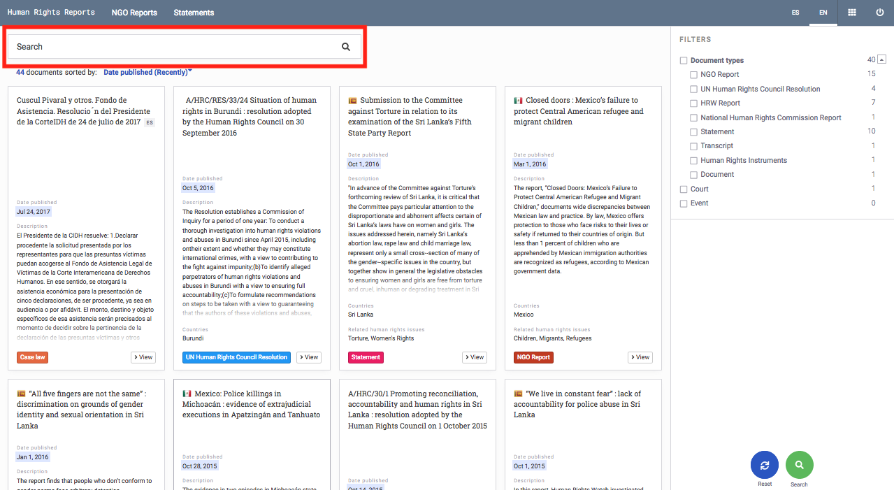

* You can perform a generic text search, which will show any terms mentioned in the search query.

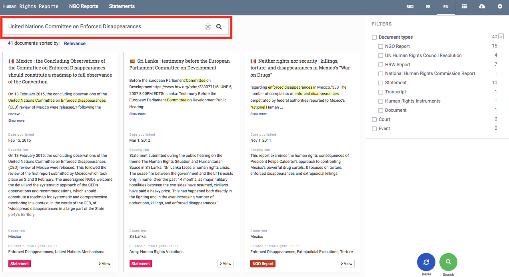

* Or you can search for a specific term or phrase using **"**...**"** to find the exact match, e.g. ''United Nations Committee on Enforced Disappearances'’. 

### Search only within a particular document

3. To search for a word or a phrase **within a particular document**. 

* Select the document you want to search.

* Click on the search text function and input what you are looking for.

* You will see all the mentions of your search query listed in chronological order as they appear in the document.

* You can click on the number under document content to take you to the correct segment of the text. 

### Advanced search queries

4. **Query string searches**: You can search for specific information using wildcards, boolean search and query strings.

<table>
  <tr>
    <td>* for wildcard search. i.e.: "juris*" will match words such as jurisdiction, jurisdictional, jurists, jurisprudence, etc.
? for one character wildcard. Ie: "198?" will match 1980 to 1989 and also 198a, 198b, etc.
Exact term match by enclosing your search string with quotes. Ie. "Costa Rica" will toss different results compared to Costa Rica without quotes.
~ for proximity searches. Ie: "the status"~5 will find anything having "the" and "status" within a distance of 5 words, such as "the procedural status", "the specific legal status".
AND, OR and NOT for boolean searches. Ie. "status AND women NOT Nicaragua" will match anything containing both the words status and women, and necessarily not containing the word Nicaragua.</td>
  </tr>
</table>

Please refer to Elasticsearch's [query string syntax page](https://www.elastic.co/guide/en/elasticsearch/reference/5.5/query-dsl-query-string-query.html#query-string-syntax) for more information on search options.

# **How to Create a Table of Contents**

Most documents have a defined structure through its pages. Creating a table of contents will allow your end-users to quickly navigate through the document’s contents. Alternatively, you can create your own structure that would be most useful to them. 

Step 1: Click on the document that you want to add the table of contents to.

Step 2: Click on the** Table of Contents** button (the A icon) on the right side panel.

Step 3: Now you can highlight the text that you want to add. Three blue icons will appear. Choose the far right circle, **Add to Table of Contents**, and the highlighted text will appear on the right sidebar.

Step 4: Repeat this process until you have created a full table of contents. You can add as many headings and subheadings as you like.

* You can add indentation by clicking on the arrow buttons. Uwazi currently supports 6 levels of indentations with different styles for every level to improve readability. 

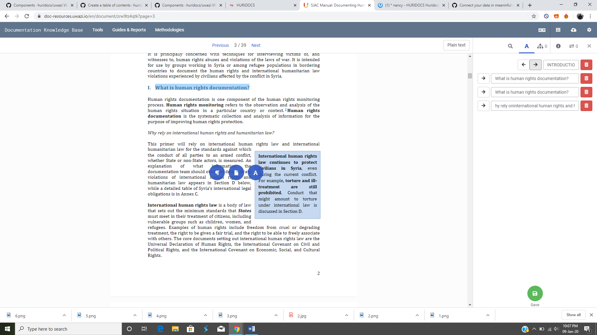

Step 5: Once you are done, click **Save**. The table of contents will now be showing. Users can click on the heading and they will be directed to the relevant segment.

Step 6: You can always come back later to revise or add more contents by clicking the **Edit** button.

# **How to Create References**

<table>
  <tr>
    <td>In Uwazi, a reference is a bookmark that connects highlighted content in one document to something else -- such as other selected content in the same document, other selected content in a different document, or even an entire document or an entity.</td>
  </tr>
</table>

### Reference other text in the same or a different document 

Step 1: Go to **Settings** and click on **Relationship types** to add a "type of connection."

* **Note:** You must define your relationship type(s) first in order to create references. 

Step 2: Click **View** on the file for which you want to create the reference. Note that references can only be made from text selected in a PDF document.

Step 3: Select the text you want. Three options will appear. Click on **Connect to a paragraph**. 

Step 4: Select the relationship type.

Step 5: Choose the document you want to refer to. You can manually search for it by title if you can't find the document you are looking for. You can also select the same document you’re currently editing.

* Note: only published entities appear in this list.

Step 6: Click **Next**, and this will take you to the document you have selected to refer to. 

Step 5: Select the relevant part of the text you want to reference, highlight it and click **Save**.

* This will create the reference for you. Users will see this referenced text under the References tab  in the right sidebar.

### Reference another document

Step 1: Go to **Settings** and click on **Relationship types** to add a "type of connection."

* **Note:** You must define your relationship type(s) first in order to create references.

Step 2: Click **View **on the file for which you want to create the reference. Note that references can only be made from text selected in a PDF document.

Step 3: Highlight the segment of text you want and click on **Connect to a document**.

Step 3: Select the relationship type.

Step 4: Select the document you want to reference. You can manually search for it by title if you can't find the document you are looking for. 

* Note: only published entities appear in this list.

Step 4: Click on **Save**.

Users will see the referenced document under the **References** tab in the right sidebar. 

When the reference is selected, the highlighted text will be displayed in the PDF.

# **How to Create Relationships**

<table>
  <tr>
    <td>In Uwazi, a relationship connects two or more entities to each other so that it’s possible to investigate and analyse "who did what to whom" (and when, and where, etc). Note: we use the terms “relationship” and “connection” interchangeably.</td>
  </tr>
</table>

Uwazi supports connecting data in unstructured ways, meaning you don't need to follow a particular data structure or predefine a relational model upfront. Entities can be connected to each other in one-to-one or one-to-many relations arbitrarily:

### Understanding "information hubs"	

Information hubs hold together a series of entities. These hubs allow you to see the relationships between your entities. They also help to infer other relationships that might have previously been overlooked. 

There are two ways in Uwazi to create connections between entities in your collection. 

### Create relationships when adding new entities 

You can create relationships when adding new entities if you have defined a template with a "Relationship" property. Click [here](#bookmark=id.u42q2wwp7f4d) to learn how to add a “Relationship” property to a template.

When creating a new entity that has a "Relationship" property in its template, you will see the relevant options that can be linked to the new entity that you are adding. You can search for entities by title using the search box.

### Create relationships between existing entities

Step 1: Go to **Settings** and click on **Relationship types** to add a "type of connection."

* **Note:** You must define your relationship type(s) first in order to connect properties. Doing Step 1 ensures that the relationship type(s) that you just created will appear as a dropdown option in the **New relationships group** field in see Step 6. 

Step 2: Select **View** on the entity that you want to add a connection with. 

Step 3: At the right side menu, click on the **Connection** icon** **. 

Step 4: Click on the blue **Edit** button.

Step 5: Here, you can make your connection. Click on **New relationships group +**.

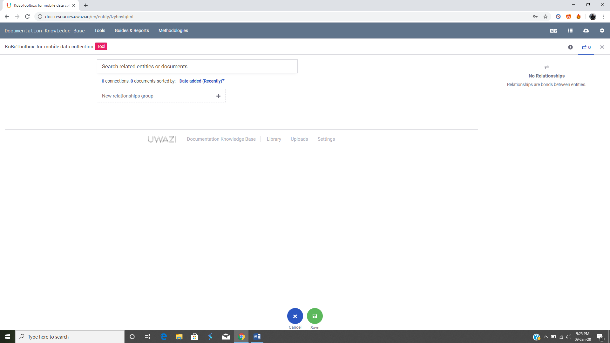

Step 6:  Select the type of relationship that you want to create in the **New connection type **dropdown. 

Step 6: Select the entity from the right bar. You can search for it by title, if it has not been recommended by the system. You can add more connections in this hub by selecting **Add entities / documents +**.

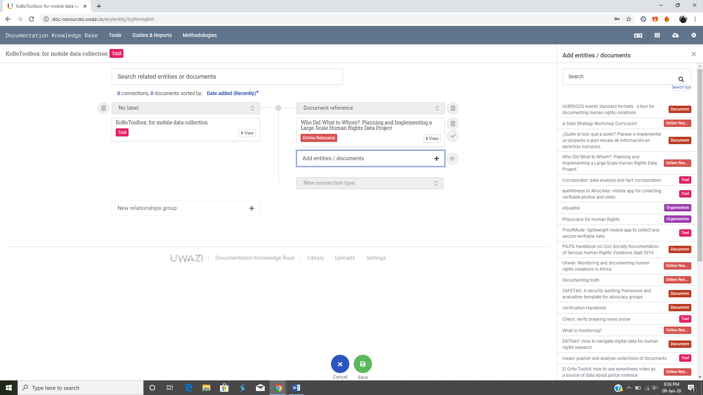

Step 8: Click **Save** when you have made the connections you want. Your new connections will appear on the Connections tab.

* You can view the connections on an entity by clicking on **View**, then on **Connections** in the right side panel. You will see existing connections of that particular entity.

### Edit connections

Step 1: You can edit existing connections on an entity by clicking on **View** on the entity for which you want to edit existing connections.

Step 2: Click on **Connections **in the right side panel. 

Step 3: Click on the blue **Edit** button. You can change the relationship type labels or remove a connection altogether by clicking on the **Delete** button.

Step 4: Click **Save** when you have completed editing your connections.

# **How to Configure the Menu / Navigation Bar**

### Add pages to the main header

Menu links are useful because they direct users to either the results of a specific filter or a static page. To configure links on the navigation bar of your website:

Step 1: Go to **Settings**, and click on **Menu**.

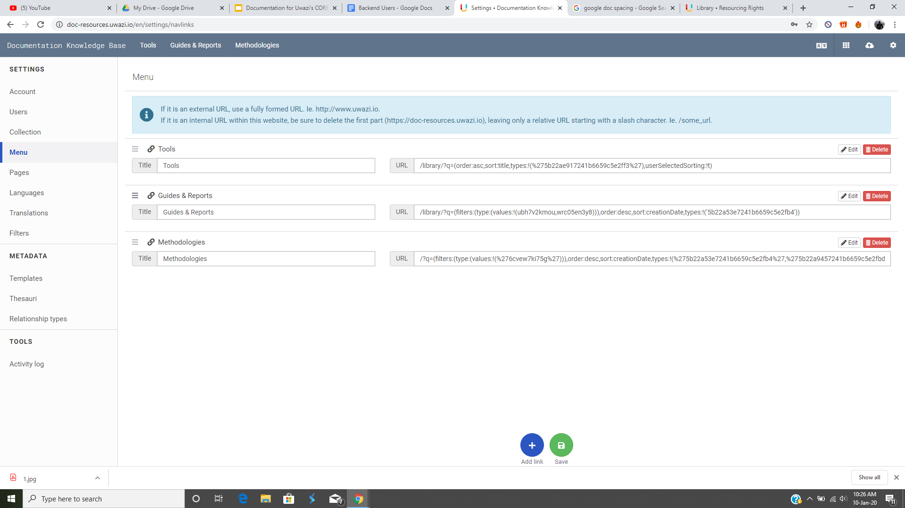

Step 2: Click on the **Add link** button, or **Edit** any of the existing links.

Step 3: Add a title for your item and the corresponding URL.

Step 4: Click **Save** when you are finished. 

### Customise the header

At the moment, it is not possible to edit the header from the **Settings**. We hope to make this available soon, however if you need this, you can create a [Github issue](https://github.com/huridocs/uwazi/issue/) and we would be happy to upload a header background image for you. In order to do so, we require:

* Your logotype in PNG format (transparent background) and 72px height. Width is not fixed, but limited to 288px, so you can play until that size.

* Your brand colour if you would like to change the header background.

# **How to Create New Web Pages **

You can add static pages to your Uwazi collection in order to share information on what the purpose of your collection is, how the general public can contact you, etc.

Step 1: Go to **Settings**, and click **Pages**.

Step 2: Create a new page by clicking **Add Page**. Add your page content and click **Save**.

Step 3: After saving a new page, you will see the unique URL assigned to it in a blue box. You may, for example, want to copy this URL and add it to the [main menu / navigation bar](#bookmark=id.syabje1hn3th).

### Format the content of a page

When you create a new page, you will notice there is no content or design yet. It appears as a blank page. To add elements onto the page requires some understanding of HTML or [Markdown](https://guides.github.com/features/mastering-markdown/). This syntax can help you to add images, lists, charts, headers, quotes and other formatting preferences to your page.  If you need help using Markdown, click on **[Hel**p](https://guides.github.com/features/mastering-markdown/) above the text box on the page. 

We have also extended the Markdown options to include some custom syntax for Uwazi users. This allows users to embed lists of entity cards, based on filter results and embed YouTube Videos. 

### Add a search box to a page

This code snippet <SearchBox /> added to any page or rich text field will render a search box that will run queries on your collections of documents:

For example: <SearchBox placeholder="Search corruption cases..." />

Renders: 

### Display a selection of cards on a page 

This code snippet added to any page or rich text field will render a card view:

{list}([https://your_uwazi_url/en/library/?q=(order:desc,sort:creationDate)](https://your_uwazi_url/en/library/?q=(order:desc,sort:creationDate)))(limit:3)

Renders: 

* This syntax will display an arbitrary number of cards, defined by the param "limit", based on a library query URL. In this case, the limit is 3 cards.

# **How to Create a Contact Form**

A contact form allows your users to message you and share their ideas. 

You can quickly create a contact form on a page by placing this code snippet: <ContactForm/>. You may add additional text in HTML around the contact form, if you wish.

This form will send a message to the e-mail address that is configured in your **Settings** > **Collection** > **Contact Email**.  

# **How to Create a Public Intake Form on Your Website**

An intake or submission form allows visitors to submit a form that creates an unpublished/private entity in your database.

Step 1: You need to define a template for this form in your instance.

Step 2: To any page, you can add this code snippet with the template ID (the numbers in your template URL):  <PublicForm template="ID_OF_THE_TEMPLATE" />

Step 3 (*optional*): 

* A document is a PDF that gets shown in the main section of Uwazi when an entity is viewed.  To add a document field to the form, add this line of code: <PublicForm template="ID_OF_THE_TEMPLATE" file />

* Attachments are attached to an entity and available for download, but their contents are not visible in Uwazi. To add an attachment field, add this line of code: <PublicForm template="ID_OF_THE_TEMPLATE" attachments />

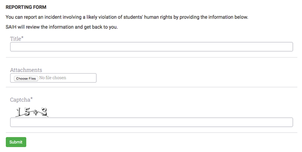

In order for the form to sync into its corresponding template, you must also do the following:

Step 1: Go to **Settings**, and click on **Collection**.

Step 2: Add the template ID (the number in the template URL) under **Allowed Public Templates**.

In the case of multiple *synced Uwazi instances* (currently an experimental feature not available to all users), you can configure submissions from a public form on one Uwazi instance to create an unpublished entity in a different Uwazi instance. To accomplish this, do the following:

Step 1: Add the template ID under **Allowed Public Templates **(in **Settings** > **Collection**) for *both* instances.

Step 2: In the Uwazi instance that has the public intake form:

* Add "remote" to the page’s code snippet, for example: <PublicForm template="ID_OF_THE_TEMPLATE" remote />

* Go to Settings, and click on Collection, add the URL of the *target* Uwazi instance under **Public Form Destination**. (e.g. https://example.uwazi.io)

# **How to Access the API for Your Instance**

<table>
  <tr>
    <td>An API allows one program to request data from another. API stands for application programming interface. An API provides you with data its programmers have made available to outside users.
The server has the data and sets the language, while the client uses that language to ask for information from the server. To make some of data available to the public, programmers "expose endpoints," meaning they publish a portion of the language they’ve used to build their program. Endpoints return text that’s meant for computers to read.
There are four types of actions an API can take:
GET: requests data from a server — can be status or specifics (like last_name)
POST: sends changes from the client to the server; think of this as adding information to the server, like making a new entry
PUT: revises or adds to existing information
DELETE: deletes existing information</td>
  </tr>
</table>

You can access the API instructions and options for your Uwazi instance by adding */api* to the end of your URL, like this:[ https://yourinstancename.uwazi.io/api](https://yourinstancename.uwazi.io/api). Uwazi requires **authorization** for POST and DELETE actions. Uwazi does not require authorization for GET actions. Uwazi currently does not use PUT actions via the API. 

These are a few examples of some endpoints that Uwazi currently offers:

<table>
  <tr>
    <td>/search</td>
    <td>/entities</td>
    <td>/attachments</td>
  </tr>
  <tr>
    <td>
</td>
    <td></td>
    <td></td>
  </tr>
</table>

Additional notes regarding the /**entities** endpoint:

* The templateId parameter sent in GET /entities/count_by_template is the mongo _id for a particular template type. For the time being, you could ask the API for templates (you can use [https://yourinstancename.uwazi.io/api/templates](https://yourinstancename.uwazi.io/api/templates)) and then get the _id from those results. Alternatively, the ID is shown in the URL if you et:dit a particular template.

Additional notes regarding the /**search** endpoint:

* There is currently no maximum amount of results returned by GET /search.  The search can return anywhere from 0 to all the documents. The default is 30 but the LIMIT property (as you can check by selecting 'load more' in the library) can be set to any number you wish. Higher numbers will take longer, be bigger and put extra toll on the server, so be careful.

Uwazi provides a list of "models" that describe the objects you have access to via the API:

<table>
  <tr>
    <td></td>
    <td></td>
  </tr>
</table>

# **How to Build Data Visualisation Components**

You can add charts and other data visualisation elements to **pages** and **rich text fields**, using the code snippets explained below. 

### Basic structure of a code snippet

### Counter component

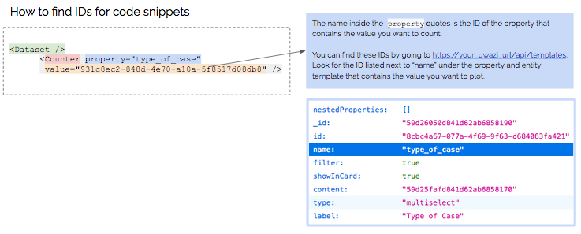

### Pie chart and list chart components

## 

## 

### Bar chart component

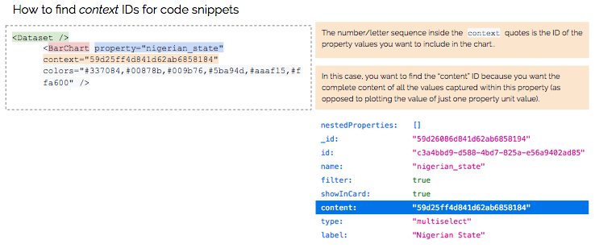

### Examples of analysis and data visualisation

Just to give you an idea of what is possible in Uwazi, please take a look at some of the public projects that are documenting human rights violations for advocacy, but please note that these require some technical proficiency in working with HTML, CSS and Javascript.

* TGEU works with 5 ProTrans partners from Eastern Europe and Central Asia on monitoring violence and human rights violations against trans people in this region. [https://tgeu.uwazi.io/](https://tgeu.uwazi.io/) 

* Justice Project Pakistan shares open source data sets based on existing research on death row and on age determination under the Juvenile Justice Systems Ordinance. This project marks the beginning of the process of making the information publicly available, allowing the public and academic institutions to generate their own findings and base their campaigns on verified data. [https://data.jpp.org.pk](https://data.jpp.org.pk) 

# **How to Display Your Information on a Map**

<table>
  <tr>
    <td>In Uwazi, there are two ways to display your information on a geographic map: by using the map toggle in the Uwazi library, and by using a map visualisation component in a page. These instructions will help you configure your information to include geographic data and display that geographic data on a map. </td>
  </tr>
</table>

### Configure your information to include geographic data

Step 1: Open the entity template that you want to be displayed on a map. 

Step 2: To configure this entity template to include geolocation coordinates, you can drag and drop the **Geolocation** property to the entity template.

Step 3: **Save** the template. 

Step 4: Create a new entity of the type you just configured. Geographic coordinates can be set via map-click or manually typing the coordinates.

### Display your information using the map toggle in the Uwazi library

When the database has entities with geolocation properties, the map toggle button  will appear as an option in Uwazi's library. Filters and searches can be used to narrow down the information displayed in the map. Users can toggle the filter/search results between map and card list view.

The map will automatically group pins in clusters. Clicking on a map pin or one of the results in the cluster,will display the entity details in the right side panel. Clicking on a cluster will display list of the included geolocated entities:

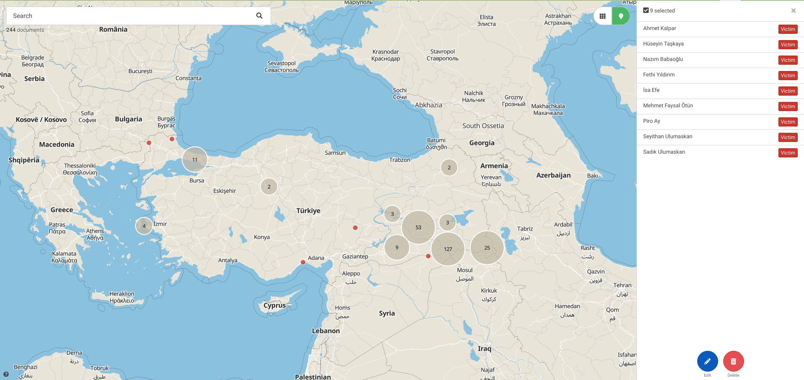

### Display your information using a map visualisation component in a page

Step 1: In your Uwazi library, narrow down the information that you want to display in your map by selecting the filters on the right side panel. When you have finished narrowing down the collection of cards in the library, copy the URL from ".../library/…"

Step 2: Open the page that you want to display your map

Step 3: The code snippet you will need to include in the page starts with:

<Dataset geolocation="true" />

<Map />

Step 4: Then you will add the URL snippet that you copied from the library:

<Dataset url="/library/?q=(_types:!(%275bfbb1a0471dd0fc16ada146%27,%275d2d9f4622220717a93dbfcd%27),limit:0,order:desc,sort:creationDate,types:!(%275bfbb1a0471dd0fc16ada146%27,%275d2d9f4622220717a93dbfcd%27))" geolocation="true" />

<Map />

Renders:

# **How to Configure EntityInfo Components**

<table>
  <tr>
    <td>EntityInfo is a collection of data visualization components that allows an entity’s information to display by opening the side panel and loading its data inside. It assigns that flow to the "click" event of whatever tag element you define. The default is a DIV, but you can configure this to a button or any other element. (Note: This requires programming knowledge.)</td>
  </tr>
</table>

EntityInfo allows you to create any HTML element (and HTML children) in a custom page. That element is assigned an *onClick* event. That click opens the side panel and displays that entity’s info on the panel. It mimics the behavior of clicking a Card in the library: the entity’s info is shown on the side panel.

This component allows you to leave the design to the page coder, so there are no styles applied.  You can turn this into a button, it could be an entire section of the page, or even an area inside a graph. You decide where to use it and Uwazi provides the "click" functionality.

<EntityInfo entity="entitySharedId" tag="div" classname="classes">More Info</EntityInfo>

Creates an HTML element of the type described in tag ("div" is default and can be omitted) bound to a "click" event that will load and display in the side panel, the info of the entity described in the "entity" property. The element allows further HTML structure inside, which allows you to tailor the 'button' look however you want.

### Query component

This component allows you to do API request to fetch data you may need and expose it in a react [context](https://reactjs.org/docs/context.html) ([https://reactjs.org/docs/context.html](https://reactjs.org/docs/context.html)) for that page, for example:

<Query name="entities" url="search?limit=10&order=desc&sort=creationDate"/>

Will search for the last 10 entities created and will store them in the "entities" dataset to be consumed. You can access this dataset with Value or Repeat for example.

### Value component

This component prints the value in a given path of the context . For example:

<Query name="entities" url="search?limit=10&order=desc&sort=creationDate"/>

<Value path="entities.rows.0.title"/>

This example will request 10 entities and then print the title of the first one.

Repeat component

The purpose of this component is to iterate over data in the context and print its contents for each entry, for example:

<Query name="entities" url="search?limit=10&order=desc&sort=creationDate"/>

<ul>

   <Repeat path="entities.rows">

     <li><Value path="title"/></li>

   </Repeat>

</ul>

### EntityLink component

This component will generate a link to the correct entity viewer based on a given entity property.

<Query name="entities" url="search?limit=10&order=desc&sort=creationDate"/>

<ul>

 <Repeat path="entities.rows">

    <li>

         <EntityLink><Value path="title"/></EntityLink>

    </li>

 </Repeat>

</ul>

### EntityLink implementation

Right now EntityLink is a very basic component that expects an Entity object in the property key "entity" to generate a Link to that Entity. Because of this reason, when used in the Pages it needs to be wrapped in a Value component that is connected to the context and passes the entity down, like in the example:

<Value propkey="entity"><EntityLink>Some text</EntityLink></Value>

# **How to Report Bugs or Problems in Uwazi**

Our main support channel is[ our Github repository](https://github.com/huridocs/uwazi/issues).

There, you will receive quick responses and get direct access to the development team.

In order to use GitHub, you will need to:

1. [Create an account](https://github.com/join) & login. It’s free. 🙂

2. Go to "[Issues](https://github.com/huridocs/uwazi/issues)" and add a new one.

3. Give your issue a precise title and description. The better your issue is described the more chances the team will quickly understand and fix it. Please check these helpful[ bug writing guidelines](https://developer.mozilla.org/en-US/docs/Mozilla/QA/Bug_writing_guidelines) from Mozilla in case you need some guidance on how to report an issue.

4. Label it as "NEW" so our team can identify them.

5. Submit.

6. GitHub will let you know through e-mail notifications when your issue is being addressed.

In the event your issue is sensitive or cannot be posted publicly, please email your contact at HURIDOCS, and we will get back to you directly.

